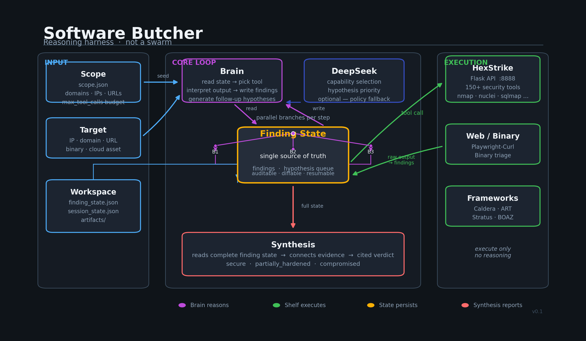

# Software Butcher

Autonomous security assessment harness built around one idea: **replace a swarm of agents with one reasoning actor, persistent memory, and a large tool shelf.**

Software Butcher reads a scoped target, runs a continuous reasoning loop against a shared finding state, executes tools through HexStrike (and pluggable framework adapters), then synthesizes an evidence-backed verdict. Frontier models power the Brain and Synthesis layers — they are swappable; results may vary by model.



---

## Philosophy

| Principle | What it means |
|-----------|---------------|
| No multi-agent orchestration | One Brain, not role-playing agents with message explosion |
| Finding state is truth | `finding_state.json` is auditable, diffable, resumable |
| Shelf executes, Brain thinks | Tools run; interpretation and routing live in the Brain |
| Models are interchangeable | DeepSeek today; another frontier model tomorrow |
| Ensemble via state, not swarms | Parallel reasoning passes converge on shared findings |

---

## Three foundations

### Shelf — execution layer

HexStrike is the default foundation: 150+ security tools behind a Flask API on port `8888`. The Shelf does not reason — it receives scoped commands and returns raw output.

Additional adapters plug in without changing the Brain contract:

- **HexStrike** — discovery, scanning, exploitation tooling
- **Playwright/Curl** — web behavior and auth-bypass probing
- **Binary triage** — local entropy/strings/symbols
- **Caldera / Atomic Red Team / Stratus** — adversary emulation
- **BOAZ / Sliver** — payload evasion and C2 (when configured)

### Brain — reasoning loop

The Brain owns the hypothesis queue and finding state:

1. Pop the next hypothesis (priority-sorted, optionally reordered by DeepSeek)
2. Read current findings and decide intent/capability (DeepSeek JSON or deterministic policy fallback)
3. Route to the correct shelf adapter
4. Interpret adapter output into structured findings
5. Generate follow-up hypotheses (SQLi, XSS, AD, cloud, auth escalation, …)
6. Write everything back to finding state and repeat

### Brain — Progressive Convergence Search (PCS)

The Brain does **not** always run N parallel branches. PCS adapts:

| Trigger | Branches | Behavior |
|---------|----------|----------|
| No high-value evidence yet | **1** | Primary path only — cheap |
| Confirmed / high-confidence finding | **3** | Evidence-triggered exploration |
| Conflicting path themes | **+2** (up to 5) | Widen search |
| Convergence score ≥ 0.75 | **1** | Validation mode — confirm, don't branch |

Each finding carries **emergent confidence**:

```json
{
  "hypothesis": "Auth bypass on /login",
  "status": "confirmed",
  "confidence": 0.65,
  "supporting_paths": 3,
  "opposing_paths": 1,
  "convergence_score": 0.83,
  "evidence_count": 12,
  "cluster_theme": "auth_bypass",
  "emergent_confidence": 0.76
}
```

### Engagement phases (post-exploit state)

Finding state tracks `engagement.phase`:

`recon` → `exploit` → `foothold` → `privesc` → `exfil` → `complete`

Phase transitions drive HTB-aware hypotheses (`user.txt`, `root.txt`, privesc enumeration).

### Confirmation pipeline

Findings promote `hypothesis` → `confirmed` when:

- Adapter marks capability `*_confirmed`
- `required_evidence` ⊆ `observed_evidence`
- Convergence score ≥ 0.70 with ≥ 2 supporting paths
- Emergent confidence ≥ 0.75 with ≥ 3 supporting paths

### Synthesis — verdict layer

After the Brain finishes (or on demand), Synthesis reads the complete finding state and produces:

- **Verdict**: `secure` · `partially_hardened` · `compromised`
- Cited findings, reproduction steps, and remediation hints
- Markdown or JSON output

With `DEEPSEEK_API_KEY` set, Synthesis can use LLM reasoning; otherwise it falls back to keyword-based classification.

---

## Quick start

### 1. Install dependencies

```bash
cd software-butcher
sudo ./setup.sh --minimal          # Python deps + essential tools
# or
sudo ./setup.sh                    # ~60 core tools
# or
sudo ./setup.sh --full --with-cloud
```

Install via pip (recommended):

```bash
pip install -e .
# or with HexStrike server deps:
pip install -e ".[hexstrike,dev]"
```

Or install manually:

```bash
pip install openai requests
pip install -r requirements.txt
```

### 2. Start HexStrike server

```bash
python3 hexstrike_server.py --port 8888
```

Verify:

```bash
curl -s http://127.0.0.1:8888/ | head
```

### 3. Configure scope

Software Butcher uses a **flat** scope file for its CLI guard. Generate one:

```bash
python3 -m software_butcher init-scope scope.json \
  --name my-assessment \
  --domain example.com \
  --url https://example.com
```

Example `scope.json`:

```json
{
  "name": "my-assessment",
  "allowed_domains": ["example.com"],
  "allowed_cidrs": [],
  "allowed_urls": ["https://example.com"],
  "allowed_files": [],
  "max_tool_calls": 50,
  "metadata": {}
}
```

> **Note:** `scope.json.example` is a comprehensive scope document. The CLI `Scope.load()` accepts both flat files and this nested format automatically.

### 4. Set DeepSeek (optional but recommended)

```bash
export DEEPSEEK_API_KEY="your-key-here"
```

Create `.env` in the project root and the `run` command loads it automatically:

```
DEEPSEEK_API_KEY=your-key-here
```

### 5. Run an assessment

```bash
python3 -m software_butcher run \
  --scope scope.json \
  --target https://example.com \
  --workspace software_butcher/workspaces/my-run \
  --steps 25 \
  --no-new-limit 5
```

Outputs:

| Path | Contents |
|------|----------|
| `workspaces/my-run/finding_state.json` | All findings + hypothesis queue |
| `workspaces/my-run/session_state.json` | Auth cookies / session data |
| `software_butcher/artifacts/` | Raw stdout/stderr per tool run |

---

## Commands

```
software_butcher
├── doctor [--config frameworks.json] [--json]
│   └── Check HexStrike, Caldera, Stratus, BOAZ, Atomic RT availability
│
├── init-config <path>
│   └── Write default framework config JSON
│
├── init-scope <path> [--name] [--domain] [--cidr] [--url] [--file]
│   └── Write a minimal flat scope file for CLI runs
│
├── bootstrap-frameworks [--target atomic_red_team|caldera|stratus_red_team] [--execute]
│   └── Print or clone external framework repos
│
├── run --scope <path> --target <locator> [options]
│   ├── --workspace   default: software_butcher/workspaces/default
│   ├── --steps       Brain iterations (default: 25)
│   ├── --max-branches  PCS ceiling (default: 5)
│   ├── --no-adaptive-pcs  disable PCS; always run max-branches
│   └── --no-new-limit  stop after N steps with zero new findings (default: 5)
│
└── synthesize --state <finding_state.json> [--json]
    └── Generate verdict report from saved state
```

### Common invocations

```bash
# Health check
python3 -m software_butcher doctor

# Short discovery pass
python3 -m software_butcher run --scope scope.json --target 192.168.1.100 --steps 10

# Full JSON output (state + verdict + events)
python3 -m software_butcher run --scope scope.json --target https://target.local --steps 50 --json

# Re-synthesize from a saved workspace
python3 -m software_butcher synthesize --state software_butcher/workspaces/my-run/finding_state.json
```

---

## Data model

### Finding

Written by the Brain after each tool run:

```json
{
  "id": "finding-abc123",
  "hypothesis": "Endpoint discovered via HTML crawl",
  "path": "https://example.com/admin",
  "provenance": "hexstrike:html_crawl",
  "status": "hypothesis",
  "confidence": 0.6,
  "evidence": ["https://example.com/admin"],
  "asset_type": "web_endpoint",
  "parent_path": "https://example.com",
  "schema_version": "0.1"
}
```

Status values: `hypothesis` · `confirmed` · `dismissed`

### Hypothesis queue

Work items the Brain consumes:

```json
{
  "id": "hyp-def456",
  "path": "https://example.com/admin",
  "reason": "Admin/auth surface should receive behavior-level validation.",
  "source_finding_id": "finding-abc123",
  "priority": 0.8,
  "status": "pending",
  "metadata": { "intent": "web_behavior_analysis", "asset_type": "web_endpoint" }
}
```

---

## Brain routing

When DeepSeek is available, the Brain asks for a JSON capability choice against the last 10 findings. On failure or missing key, deterministic policy takes over (`brain/policy.py`).

Capability → adapter mapping (simplified):

| Signal / intent | Adapter |
|-----------------|---------|
| `discover`, `port_scanning`, `vulnerability_scanning`, … | HexStrike |
| `web_behavior_analysis` | Playwright/Curl |
| `reverse_engineer` | Binary triage |
| `validate_ad_emulation` | Caldera |
| `validate_cloud_attack_path` | Stratus |
| `deep_fuzz`, `payload_evasion` | BOAZ |

Full capability list is declared on `HexstrikeAdapter.capabilities` in `shelves/hexstrike/adapter.py`.

---

## Docker

```bash
docker-compose up -d
docker exec -it hexstrike_app bash
python3 hexstrike_server.py --port 8888
```

The Dockerfile ships a Kali-based image with core tools pre-installed. The container starts in interactive bash; start the server manually inside.

---

## Project layout

```
software-butcher/
├── software_butcher/
│   ├── brain/           # Loop, policy, hypotheses, DeepSeek advisor
│   ├── shelves/         # HexStrike, web, binary, framework adapters
│   ├── state/           # Finding store, hypothesis queue, session state
│   ├── synthesis/       # Verdict + report generation
│   └── core/            # Scope, router, registry, runner
├── hexstrike_server.py  # Tool server (Flask, port 8888)
├── hexstrike_mcp.py     # MCP bridge for external agents
├── scope.json.example   # Comprehensive HexStrike scope template
├── examples/            # HexStrike scope API examples
├── docs/
│   └── architecture.png
└── setup.sh             # Tool + Python installer
```

---

## Environment variables

| Variable | Used by | Purpose |
|----------|---------|---------|
| `DEEPSEEK_API_KEY` | Brain, Synthesis | LLM capability selection and verdict |
| `HEXSTRIKE_URL` | Framework health | Override default `http://127.0.0.1:8888` |
| `HEXSTRIKE_TIMEOUT` | HexStrike client | Request timeout seconds (default: 60) |
| `CALDERA_URL` / `CALDERA_API_KEY` | Caldera adapter | Adversary emulation |
| `STRATUS_*` | Stratus adapter | Cloud attack simulation |

---

## Testing

```bash
python3 -m pytest software_butcher/tests/ -q
```

Current coverage: policy routing, hypothesis generation, finding store, HexStrike adapter normalization.

---

## Regenerate architecture diagram

```bash
python3 scripts/generate_architecture_diagram.py
```

---

## License / usage

Software Butcher and HexStrike are offensive-security tooling. Run only against targets you are explicitly authorized to test. Scope files exist to enforce that boundary at the harness level — out-of-scope targets are rejected before any tool executes.
